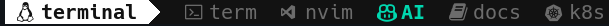
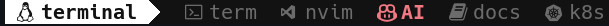
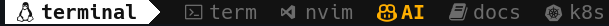
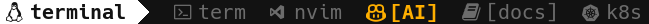
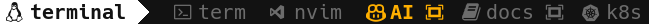
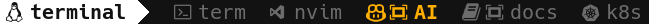
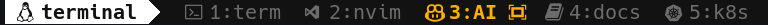

# Add NerdFont icons to tmux window name









## Features

- [x] hi-customize theme color
- [x] customize zoom sign
- [x] auto set icon based-on window name using regex
- [ ] auto set background based-on session name using regex

## Requirements

- [tpm](https://github.com/tmux-plugins/tpm) for install and load plugin
- [Nerd font](https://www.nerdfonts.com/#home) for display icons

## Setup

1. add below line to your `tmux.conf` with predefined icons for window name

```tmux
set -g @plugin 'dtanphat9388/tmux-theme'
set -g @tmux_theme_window_icon "
 (z|ba)?sh|term
 n?vim|code|tmux|book.*
 book|man(ual)?|docs?|cheat
󱃾 kube.*|k8s|helm(file)?
 ai|copilot
"
```

2. Reload tmux config with command `tmux source-file`.
3. press `<prefix>I` to install and boooom
4. If tmux theme not effect, relaunch tmux with command `tmux kill-server`
5. Remove following redundance options if you have:
   - remove status-position option

## Theme customize via options

```diff
set -g @plugin 'dtanphat9388/tmux-theme'
+set -g @tmux_theme_{option_name}
+ #...
```

| option name             |  default value   | desc                                   |
| ----------------------- | :--------------: | -------------------------------------- |
| `color_bg`              |     terminal     | transparent                            |
| `color_active`          |     #17C3B2      | color on active (ex: window, border)   |
| `color_inactive`        |     #686868      | color on inactive (ex: window, border) |
| `left_color_bg`         |     #FFFFFF      |                                        |
| `left_length`           |        25        | length of left section                 |
| `right_color_bg`        |     #FFFFFF      |                                        |
| `right_length`          |        50        | length of right section                |
| `right_label`           |  #{host_short}   | length of right section                |
| `window_name_format`    |        #W        | length of right section                |
| `window_zoom_format`    |       [#W]       | length of right section                |
| `window_icon`           |                  | show icon by window name               |
| `border_color_active`   |  `color_active`  |                                        |
| `border_color_inactive` | `color_inactive` |                                        |

### Icons


- icons will appear for window name match with regex
- window name is case-insensitive

```tmux
set -g @tmux_theme_window_icon "
 (z|ba)?sh|term
 n?vim|code|tmux|book.*
 book|man(ual)?|docs?|cheat
󱃾 kube.*|k8s|helm(file)?
 ai|copilot
"
```

### Window and border color

- set active color
  
  

```tmux
set -g @tmux_theme_color_active "red"
```

### Window name and zoom format

- default format `[#W]`
  
- use '' icon as zoom indicator '#W ' in after
  
- use '' icon as zoom indicator ' #W' in before
  
- use `#I` in window name to enable window index (ex: `#I:#W `)
  

```tmux
set -g @tmux_theme_window_name_format '#W'
set -g @tmux_theme_window_zoom_format '#W '
```

## Well-know issues

- icons is smaller because your font is mono font
